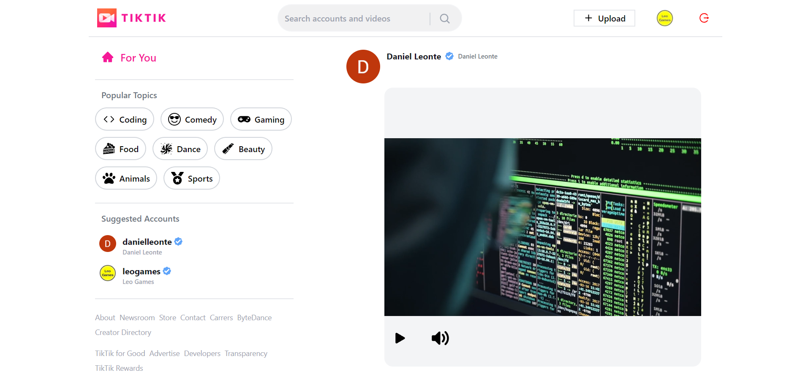

# TikTik ♪

## General Info
**TikTik - Video-Sharing Social Media Website. This TikTok Clone Application includes Google Auth, the ability to upload, publish, share, comment on, and like the videos; filtering by categories and advanced search functionalities, profile pages, suggested accounts, custom responsive design, and much more..** 
<a href="https://tiktok-clone-final-iota.vercel.app" target="_blank" >👉🎯👈</a>

***

Technologies:
- React JS
- Next JS
- TypeScript
- Tailwind CSS
- Sanity
- Zustand

## Available Scripts

In the project directory, you can run:

### `npm run dev`

Runs the app in the development mode.\
Open [http://localhost:3000](http://localhost:3000) to view it in your browser.
